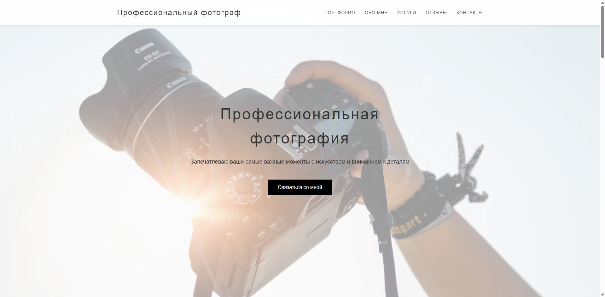
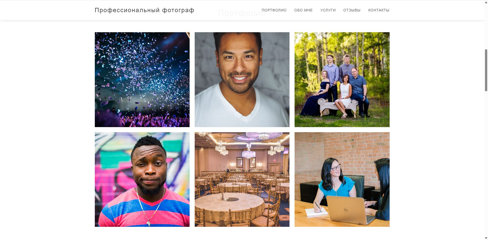
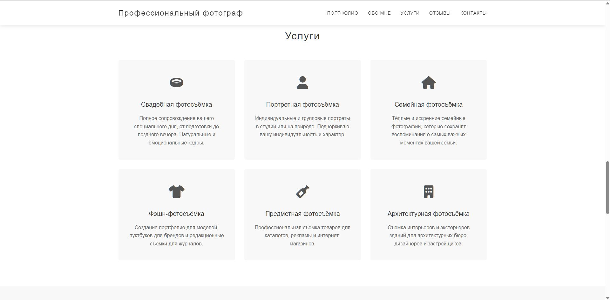
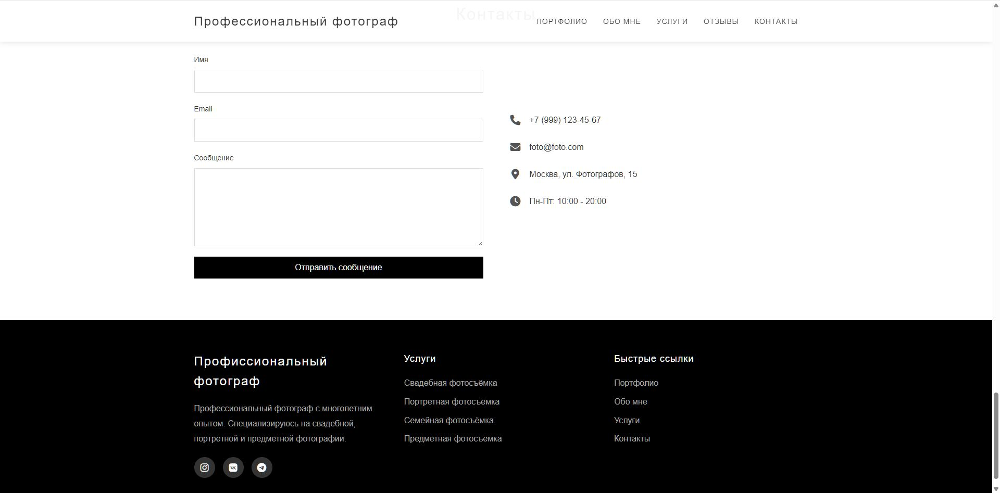

# 📸 Photographer Portfolio Demo

Демонстрационный сайт-портфолио для фотографа.  
Проект создан для демонстрации навыков адаптивной вёрстки, организации контента и оформления сайта с чистой структурой.

🔗 **Онлайн демо:** [Посмотреть на GitHub Pages](https://hoadf.github.io/photographer-portfolio-demo/)  
💾 **Исходный код:** [Репозиторий на GitHub](https://github.com/hoadf/photographer-portfolio-demo)

---

## 🖼️ Превью

---

## 📸 Скриншоты

| Работы | Портфолио | Контакты |
|----------|------------|-----------|
|  |  |  |

---

## 💡 О проекте

Этот сайт разработан как пример современного одностраничного портфолио для фотографа.  
Демонстрирует:
- адаптивную структуру и сетку;
- простое и интуитивное меню навигации;
- аккуратное разделение контента по секциям;
- работу с формами и иконками;
- обработку ошибок изображений через JavaScript.

Все изображения взяты из открытых источников и используются только для демонстрации.

---

## 🧩 Технологии

- **HTML5** — структура страниц  
- **CSS3** — стили и адаптивность  
- **JavaScript (ES6)** — интерактивность (меню, плавная прокрутка, обработка форм)

---

## 📤 Хостинг

Сайт опубликован с помощью **GitHub Pages**.

---

## 📄 Лицензия

Проект опубликован под лицензией [MIT](LICENSE).  
Разрешено использование кода в учебных и демонстрационных целях с указанием автора.

---

✉️ **Автор проекта:** *HOADF*  
💬 **Направление:** создание сайтов и веб-приложений, интеграция с ChatGPT, Python-разработка, визуализация в Blender.  
